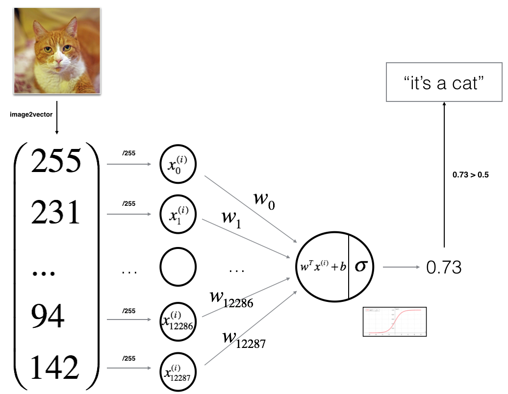

Bienvenido a tu primera tarea de programacion (obligatoria). Construiras un clasificador de regresion logistica para reconocer gatos. Esta tarea te guiara paso a paso sobre como hacerlo con una mentalidad de Red Neuronal, y tambien afinara tus intuiciones sobre deep learning.

**Instrucciones:**
- No uses bucles (for/while) en tu codigo, a menos que las instrucciones te lo pidan explicitamente.
- Usa `np.dot(X,Y)` para calcular productos punto.

**Aprenderas a:**
- Construir la arquitectura general de un algoritmo de aprendizaje, incluyendo:
    - Inicializar parametros
    - Calcular la funcion de costo y su gradiente
    - Usar un algoritmo de optimizacion (descenso de gradiente)
- Reunir las tres funciones anteriores en una funcion principal del modelo, en el orden correcto.

## Nota importante sobre el envio al AutoGrader

Antes de enviar tu tarea al AutoGrader, asegurate de no estar haciendo lo siguiente:

1. No has agregado declaraciones `print` adicionales en la tarea.
2. No has agregado celdas de codigo adicionales en la tarea.
3. No has cambiado los parametros de las funciones.
4. No estas usando variables globales dentro de tus ejercicios calificados.
5. No estas cambiando el codigo de la tarea donde no se requiere.


## Tabla de Contenidos
- [1 - Paquetes](#1)
- [2 - Vision general del conjunto de datos](#2)
    - [Ejercicio 1](#ex-1)
    - [Ejercicio 2](#ex-2)
- [3 - Arquitectura general del algoritmo de aprendizaje](#3)
- [4 - Construyendo las partes de nuestro algoritmo](#4)
    - [4.1 - Funciones auxiliares](#4-1)
        - [Ejercicio 3 - sigmoid](#ex-3)
    - [4.2 - Inicializando parametros](#4-2)
        - [Ejercicio 4 - initialize_with_zeros](#ex-4)
    - [4.3 - Propagacion hacia adelante y hacia atras](#4-3)
        - [Ejercicio 5 - propagate](#ex-5)
    - [4.4 - Optimizacion](#4-4)
        - [Ejercicio 6 - optimize](#ex-6)
        - [Ejercicio 7 - predict](#ex-7)
- [5 - Unir todas las funciones en un modelo](#5)
    - [Ejercicio 8 - model](#ex-8)
- [6 - Analisis adicional (ejercicio opcional/no calificado)](#6)
- [7 - Prueba con tu propia imagen (ejercicio opcional/no calificado)](#7)

<a name='1'></a>
## 1 - Paquetes ##

Primero, ejecuta la celda de abajo para importar todos los paquetes que necesitaras durante esta tarea.
- [numpy](https://numpy.org/doc/1.20/) es el paquete fundamental para computacion cientifica con Python.
- [h5py](http://www.h5py.org) es un paquete comun para interactuar con conjuntos de datos almacenados en archivos H5.
- [matplotlib](http://matplotlib.org) es una biblioteca famosa para graficar en Python.
- [PIL](https://pillow.readthedocs.io/en/stable/) y [scipy](https://www.scipy.org/) se usan aqui para probar tu modelo con tu propia imagen al final.

```{python}
#| deletable: false
#| editable: false
### v1.2
```

```{python}
import numpy as np
import copy
import matplotlib.pyplot as plt
import h5py
import scipy
from PIL import Image
from scipy import ndimage
from lr_utils import load_dataset
from public_tests import *

%matplotlib inline
%load_ext autoreload
%autoreload 2
```

<a name='2'></a>
## 2 - Vision general del conjunto de datos ##

**Enunciado del problema**: Se te proporciona un conjunto de datos ("data.h5") que contiene:
    - un conjunto de entrenamiento de m_train imagenes etiquetadas como gato (y=1) o no-gato (y=0)
    - un conjunto de prueba de m_test imagenes etiquetadas como gato o no-gato
    - cada imagen tiene forma (num_px, num_px, 3) donde 3 es para los 3 canales (RGB). Por lo tanto, cada imagen es cuadrada (alto = num_px) y (ancho = num_px).

Construiras un algoritmo simple de reconocimiento de imagenes que pueda clasificar correctamente las imagenes como gato o no-gato.

Familiaricemonos mas con el conjunto de datos. Carga los datos ejecutando el siguiente codigo.

```{python}
# Loading the data (cat/non-cat)
train_set_x_orig, train_set_y, test_set_x_orig, test_set_y, classes = load_dataset()
```

Agregamos "_orig" al final de los conjuntos de datos de imagenes (train y test) porque vamos a preprocesarlos. Despues del preprocesamiento, terminaremos con train_set_x y test_set_x (las etiquetas train_set_y y test_set_y no necesitan preprocesamiento).

Cada linea de train_set_x_orig y test_set_x_orig es un arreglo que representa una imagen. Puedes visualizar un ejemplo ejecutando el siguiente codigo. Tambien puedes cambiar el valor de `index` y volver a ejecutar para ver otras imagenes.

```{python}
# Example of a picture
index = 25
plt.imshow(train_set_x_orig[index])
print ("y = " + str(train_set_y[:, index]) + ", it's a '" + classes[np.squeeze(train_set_y[:, index])].decode("utf-8") +  "' picture.")
```

Muchos errores de software en deep learning provienen de tener dimensiones de matrices/vectores que no coinciden. Si mantienes las dimensiones de tus matrices/vectores correctas, eliminaras muchos errores.

<a name='ex-1'></a>
### Ejercicio 1
Encuentra los valores para:
    - m_train (numero de ejemplos de entrenamiento)
    - m_test (numero de ejemplos de prueba)
    - num_px (= alto = ancho de una imagen de entrenamiento)
Recuerda que `train_set_x_orig` es un arreglo numpy de forma (m_train, num_px, num_px, 3). Por ejemplo, puedes acceder a `m_train` escribiendo `train_set_x_orig.shape[0]`.

```{python}
#| deletable: false
#| nbgrader: {cell_type: code, checksum: 921fe679a632ec7ec9963069fa405725, grade: false, grade_id: cell-c4e7e9c1f174eb83, locked: false, schema_version: 3, solution: true, task: false}
#(≈ 3 lines of code)
# m_train = 
# m_test = 
# num_px = 
# YOUR CODE STARTS HERE

m_train = train_set_x_orig.shape[0]
m_test = test_set_x_orig.shape[0]
num_px = train_set_x_orig.shape[1]

# YOUR CODE ENDS HERE

print ("Number of training examples: m_train = " + str(m_train))
print ("Number of testing examples: m_test = " + str(m_test))
print ("Height/Width of each image: num_px = " + str(num_px))
print ("Each image is of size: (" + str(num_px) + ", " + str(num_px) + ", 3)")
print ("train_set_x shape: " + str(train_set_x_orig.shape))
print ("train_set_y shape: " + str(train_set_y.shape))
print ("test_set_x shape: " + str(test_set_x_orig.shape))
print ("test_set_y shape: " + str(test_set_y.shape))
```

**Salida esperada para m_train, m_test y num_px**: 
<table style="width:15%">
  <tr>
    <td> m_train </td>
    <td> 209 </td> 
  </tr>
  <tr>
    <td>m_test</td>
    <td> 50 </td> 
  </tr>
  <tr>
    <td>num_px</td>
    <td> 64 </td> 
  </tr>
</table>

Por conveniencia, ahora debes remodelar las imagenes de forma (num_px, num_px, 3) en un arreglo numpy de forma (num_px $*$ num_px $*$ 3, 1). Despues de esto, nuestro conjunto de datos de entrenamiento (y prueba) es un arreglo numpy donde cada columna representa una imagen aplanada. Deberia haber m_train (respectivamente m_test) columnas.

<a name='ex-2'></a>
### Ejercicio 2
Remodela los conjuntos de datos de entrenamiento y prueba para que las imagenes de tamano (num_px, num_px, 3) se aplanen en vectores individuales de forma (num\_px $*$ num\_px $*$ 3, 1).

Un truco cuando quieres aplanar una matriz X de forma (a,b,c,d) a una matriz X_flatten de forma (b$*$c$*$d, a) es usar:
```python
X_flatten = X.reshape(X.shape[0], -1).T      # X.T es la transpuesta de X
```

```{python}
#| deletable: false
#| nbgrader: {cell_type: code, checksum: 5a2aa62bdd8c01450111b758ef159aec, grade: false, grade_id: cell-0f43921062c34e50, locked: false, schema_version: 3, solution: true, task: false}
# Reshape the training and test examples
#(≈ 2 lines of code)
# train_set_x_flatten = ...
# test_set_x_flatten = ...
# YOUR CODE STARTS HERE

train_set_x_flatten = train_set_x_orig.reshape(train_set_x_orig.shape[0], -1).T
test_set_x_flatten = test_set_x_orig.reshape(test_set_x_orig.shape[0], -1).T

# YOUR CODE ENDS HERE

# Check that the first 10 pixels of the second image are in the correct place
assert np.all(train_set_x_flatten[0:10, 1] == [196, 192, 190, 193, 186, 182, 188, 179, 174, 213]), "Wrong solution. Use (X.shape[0], -1).T."
assert np.all(test_set_x_flatten[0:10, 1] == [115, 110, 111, 137, 129, 129, 155, 146, 145, 159]), "Wrong solution. Use (X.shape[0], -1).T."


print ("train_set_x_flatten shape: " + str(train_set_x_flatten.shape))
print ("train_set_y shape: " + str(train_set_y.shape))
print ("test_set_x_flatten shape: " + str(test_set_x_flatten.shape))
print ("test_set_y shape: " + str(test_set_y.shape))
```

**Salida esperada**: 

<table style="width:35%">
  <tr>
    <td>train_set_x_flatten shape</td>
    <td> (12288, 209)</td> 
  </tr>
  <tr>
    <td>train_set_y shape</td>
    <td>(1, 209)</td> 
  </tr>
  <tr>
    <td>test_set_x_flatten shape</td>
    <td>(12288, 50)</td> 
  </tr>
  <tr>
    <td>test_set_y shape</td>
    <td>(1, 50)</td> 
  </tr>
</table>

Para representar imagenes a color, se deben especificar los canales rojo, verde y azul (RGB) para cada pixel, por lo que el valor del pixel es en realidad un vector de tres numeros que van de 0 a 255.

Un paso comun de preprocesamiento en machine learning es centrar y estandarizar tu conjunto de datos, lo que significa que restas la media de todo el arreglo numpy de cada ejemplo, y luego divides cada ejemplo por la desviacion estandar de todo el arreglo numpy. Pero para conjuntos de datos de imagenes, es mas simple y conveniente y funciona casi igual de bien simplemente dividir cada fila del conjunto de datos por 255 (el valor maximo de un canal de pixel).

Estandaricemos nuestro conjunto de datos.

```{python}
train_set_x = train_set_x_flatten / 255.
test_set_x = test_set_x_flatten / 255.
```

<font color='blue'>


**Lo que necesitas recordar:**

Los pasos comunes para preprocesar un nuevo conjunto de datos son:
- Determinar las dimensiones y formas del problema (m_train, m_test, num_px, ...)
- Remodelar los conjuntos de datos para que cada ejemplo sea ahora un vector de tamano (num_px \* num_px \* 3, 1)
- "Estandarizar" los datos

<a name='3'></a>
## 3 - Arquitectura general del algoritmo de aprendizaje ##

Es hora de disenar un algoritmo simple para distinguir imagenes de gatos de imagenes de no-gatos.

Construiras una Regresion Logistica, usando una mentalidad de Red Neuronal. La siguiente figura explica por que **la Regresion Logistica es en realidad una Red Neuronal muy simple.**



**Expresion matematica del algoritmo**:

Para un ejemplo $x^{(i)}$:

$$z^{(i)} = w^T x^{(i)} + b \tag{1}$$

$$\hat{y}^{(i)} = a^{(i)} = \text{sigmoid}(z^{(i)})\tag{2}$$

$$\mathcal{L}(a^{(i)}, y^{(i)}) = - y^{(i)} \log(a^{(i)}) - (1-y^{(i)}) \log(1-a^{(i)})\tag{3}$$

El costo se calcula sumando sobre todos los ejemplos de entrenamiento:
$$ J = \frac{1}{m} \sum_{i=1}^m \mathcal{L}(a^{(i)}, y^{(i)})\tag{6}$$

**Pasos clave**:
En este ejercicio, llevaras a cabo los siguientes pasos:
    - Inicializar los parametros del modelo
    - Aprender los parametros del modelo minimizando el costo
    - Usar los parametros aprendidos para hacer predicciones (en el conjunto de prueba)
    - Analizar los resultados y concluir

<a name='4'></a>
## 4 - Construyendo las partes de nuestro algoritmo ## 

Los pasos principales para construir una Red Neuronal son:
1. Definir la estructura del modelo (como el numero de caracteristicas de entrada)
2. Inicializar los parametros del modelo
3. Bucle:
    - Calcular la perdida actual (propagacion hacia adelante)
    - Calcular el gradiente actual (propagacion hacia atras)
    - Actualizar parametros (descenso de gradiente)

Generalmente construyes los pasos 1-3 por separado y los integras en una funcion que llamamos `model()`.

<a name='4-1'></a>
### 4.1 - Funciones auxiliares

<a name='ex-3'></a>
### Ejercicio 3 - sigmoid
Usando tu codigo de "Python Basics", implementa `sigmoid()`. Como viste en la figura anterior, necesitas calcular $sigmoid(z) = \frac{1}{1 + e^{-z}}$ para $z = w^T x + b$ para hacer predicciones. Usa np.exp().

```{python}
#| deletable: false
#| nbgrader: {cell_type: code, checksum: 239ab1cf1028b721fd14f31b8103c40d, grade: false, grade_id: cell-520521c430352f3b, locked: false, schema_version: 3, solution: true, task: false}
# GRADED FUNCTION: sigmoid

def sigmoid(z):
    """
    Compute the sigmoid of z

    Arguments:
    z -- A scalar or numpy array of any size.

    Return:
    s -- sigmoid(z)
    """

    #(≈ 1 line of code)
    # s = ...
    # YOUR CODE STARTS HERE
    
    s = 1 / (1 + np.exp(-z))
    
    # YOUR CODE ENDS HERE
    
    return s
```

```{python}
#| deletable: false
#| editable: false
#| nbgrader: {cell_type: code, checksum: 0483e6820669111a9c5914d8b24bc315, grade: true, grade_id: cell-30ea3151cab9c491, locked: true, points: 10, schema_version: 3, solution: false, task: false}
print ("sigmoid([0, 2]) = " + str(sigmoid(np.array([0,2]))))

sigmoid_test(sigmoid)
```

```{python}
x = np.array([0.5, 0, 2.0])
output = sigmoid(x)
print(output)
```

<a name='4-2'></a>
### 4.2 - Inicializando parametros

<a name='ex-4'></a>
### Ejercicio 4 - initialize_with_zeros
Implementa la inicializacion de parametros en la celda de abajo. Debes inicializar w como un vector de ceros. Si no sabes que funcion de numpy usar, busca np.zeros() en la documentacion de la biblioteca Numpy.

```{python}
#| deletable: false
#| nbgrader: {cell_type: code, checksum: c4a37e375a85ddab7274a33abf46bb7c, grade: false, grade_id: cell-befa9335e479864e, locked: false, schema_version: 3, solution: true, task: false}
# GRADED FUNCTION: initialize_with_zeros

def initialize_with_zeros(dim):
    """
    This function creates a vector of zeros of shape (dim, 1) for w and initializes b to 0.
    
    Argument:
    dim -- size of the w vector we want (or number of parameters in this case)
    
    Returns:
    w -- initialized vector of shape (dim, 1)
    b -- initialized scalar (corresponds to the bias) of type float
    """
    
    # (≈ 2 lines of code)
    # w = ...
    # b = ...
    # YOUR CODE STARTS HERE
    
    w = np.zeros((dim, 1))
    b = 0.0
    
    # YOUR CODE ENDS HERE

    return w, b
```

```{python}
#| deletable: false
#| editable: false
#| nbgrader: {cell_type: code, checksum: a4c13b0eafa46ca94de21b41faea8c58, grade: true, grade_id: cell-a3b6699f145f3a3f, locked: true, points: 10, schema_version: 3, solution: false, task: false}
dim = 2
w, b = initialize_with_zeros(dim)

assert type(b) == float
print ("w = " + str(w))
print ("b = " + str(b))

initialize_with_zeros_test_1(initialize_with_zeros)
initialize_with_zeros_test_2(initialize_with_zeros)
```

<a name='4-3'></a>
### 4.3 - Propagacion hacia adelante y hacia atras

Ahora que tus parametros estan inicializados, puedes realizar los pasos de propagacion "hacia adelante" y "hacia atras" para aprender los parametros.

<a name='ex-5'></a>
### Ejercicio 5 - propagate
Implementa una funcion `propagate()` que calcule la funcion de costo y su gradiente.

**Pistas**:

Propagacion hacia adelante:
- Obtienes X
- Calculas $A = \sigma(w^T X + b) = (a^{(1)}, a^{(2)}, ..., a^{(m-1)}, a^{(m)})$
- Calculas la funcion de costo: $J = -\frac{1}{m}\sum_{i=1}^{m}(y^{(i)}\log(a^{(i)})+(1-y^{(i)})\log(1-a^{(i)}))$

Aqui estan las dos formulas que usaras:

$$ \frac{\partial J}{\partial w} = \frac{1}{m}X(A-Y)^T\tag{7}$$
$$ \frac{\partial J}{\partial b} = \frac{1}{m} \sum_{i=1}^m (a^{(i)}-y^{(i)})\tag{8}$$

```{python}
#| deletable: false
#| nbgrader: {cell_type: code, checksum: 8552b2c9cff2b5fa537fab9f98a6e4da, grade: false, grade_id: cell-11af17e28077b3d3, locked: false, schema_version: 3, solution: true, task: false}
# GRADED FUNCTION: propagate

def propagate(w, b, X, Y):
    """
    Implement the cost function and its gradient for the propagation explained above

    Arguments:
    w -- weights, a numpy array of size (num_px * num_px * 3, 1)
    b -- bias, a scalar
    X -- data of size (num_px * num_px * 3, number of examples)
    Y -- true "label" vector (containing 0 if non-cat, 1 if cat) of size (1, number of examples)

    Return:
    grads -- dictionary containing the gradients of the weights and bias
            (dw -- gradient of the loss with respect to w, thus same shape as w)
            (db -- gradient of the loss with respect to b, thus same shape as b)
    cost -- negative log-likelihood cost for logistic regression
    
    Tips:
    - Write your code step by step for the propagation. np.log(), np.dot()
    """
    
    m = X.shape[1]
    
    # FORWARD PROPAGATION (FROM X TO COST)
    #(≈ 2 lines of code)
    # compute activation
    # A = ...
    # compute cost by using np.dot to perform multiplication. 
    # And don't use loops for the sum.
    # cost = ...                                
    # YOUR CODE STARTS HERE
    
    A = sigmoid(np.dot(w.T, X) + b)
    cost = -1/m * np.sum(Y * np.log(A) + (1 - Y) * np.log(1 - A))
    
    # YOUR CODE ENDS HERE

    # BACKWARD PROPAGATION (TO FIND GRAD)
    #(≈ 2 lines of code)
    # dw = ...
    # db = ...
    # YOUR CODE STARTS HERE
    
    dw = 1/m * np.dot(X, (A - Y).T)
    db = 1/m * np.sum(A - Y)
    
    # YOUR CODE ENDS HERE
    cost = np.squeeze(np.array(cost))

    
    grads = {"dw": dw,
             "db": db}
    
    return grads, cost
```

```{python}
#| deletable: false
#| editable: false
#| nbgrader: {cell_type: code, checksum: 89373f564dc33ce8a883a55a6ef72b56, grade: true, grade_id: cell-d1594d75b61dd554, locked: true, points: 10, schema_version: 3, solution: false, task: false}
w =  np.array([[1.], [2]])
b = 1.5

# X is using 3 examples, with 2 features each
# Each example is stacked column-wise
X = np.array([[1., -2., -1.], [3., 0.5, -3.2]])
Y = np.array([[1, 1, 0]])
grads, cost = propagate(w, b, X, Y)

assert type(grads["dw"]) == np.ndarray
assert grads["dw"].shape == (2, 1)
assert type(grads["db"]) == np.float64


print ("dw = " + str(grads["dw"]))
print ("db = " + str(grads["db"]))
print ("cost = " + str(cost))

propagate_test(propagate)
```

**Salida esperada**

```
dw = [[ 0.25071532]
 [-0.06604096]]
db = -0.1250040450043965
cost = 0.15900537707692405
```

<a name='4-4'></a>
### 4.4 - Optimizacion
- Has inicializado tus parametros.
- Tambien puedes calcular una funcion de costo y su gradiente.
- Ahora, quieres actualizar los parametros usando descenso de gradiente.

<a name='ex-6'></a>
### Ejercicio 6 - optimize
Escribe la funcion de optimizacion. El objetivo es aprender $w$ y $b$ minimizando la funcion de costo $J$. Para un parametro $\theta$, la regla de actualizacion es $ \theta = \theta - \alpha \text{ } d\theta$, donde $\alpha$ es la tasa de aprendizaje.

```{python}
#| deletable: false
#| nbgrader: {cell_type: code, checksum: 49d9b4c1a780bf141c8eb48e06cbb494, grade: false, grade_id: cell-616d6883e807448d, locked: false, schema_version: 3, solution: true, task: false}
# GRADED FUNCTION: optimize

def optimize(w, b, X, Y, num_iterations=100, learning_rate=0.009, print_cost=False):
    """
    This function optimizes w and b by running a gradient descent algorithm
    
    Arguments:
    w -- weights, a numpy array of size (num_px * num_px * 3, 1)
    b -- bias, a scalar
    X -- data of shape (num_px * num_px * 3, number of examples)
    Y -- true "label" vector (containing 0 if non-cat, 1 if cat), of shape (1, number of examples)
    num_iterations -- number of iterations of the optimization loop
    learning_rate -- learning rate of the gradient descent update rule
    print_cost -- True to print the loss every 100 steps
    
    Returns:
    params -- dictionary containing the weights w and bias b
    grads -- dictionary containing the gradients of the weights and bias with respect to the cost function
    costs -- list of all the costs computed during the optimization, this will be used to plot the learning curve.
    
    Tips:
    You basically need to write down two steps and iterate through them:
        1) Calculate the cost and the gradient for the current parameters. Use propagate().
        2) Update the parameters using gradient descent rule for w and b.
    """
    
    w = copy.deepcopy(w)
    b = copy.deepcopy(b)
    
    costs = []
    
    for i in range(num_iterations):
        # (≈ 1 lines of code)
        # Cost and gradient calculation 
        # grads, cost = ...
        # YOUR CODE STARTS HERE
        
        grads, cost = propagate(w, b, X, Y)
        
        # YOUR CODE ENDS HERE
        
        # Retrieve derivatives from grads
        
        dw = grads["dw"]
        db = grads["db"]
        
        # update rule (≈ 2 lines of code)
        # w = ...
        # b = ...
        # YOUR CODE STARTS HERE
        
        w = w - learning_rate * dw
        b = b - learning_rate * db
        
        # YOUR CODE ENDS HERE
        
        # Record the costs
        if i % 100 == 0:
            costs.append(cost)
        
            # Print the cost every 100 training iterations
            if print_cost:
                print ("Cost after iteration %i: %f" %(i, cost))
    
    params = {"w": w,
              "b": b}
    
    grads = {"dw": dw,
             "db": db}
    
    return params, grads, costs
```

```{python}
#| deletable: false
#| editable: false
#| nbgrader: {cell_type: code, checksum: b65a5c90f86a990614156e41f64b4678, grade: true, grade_id: cell-8e3d43fbb82a8901, locked: true, points: 10, schema_version: 3, solution: false, task: false}
params, grads, costs = optimize(w, b, X, Y, num_iterations=100, learning_rate=0.009, print_cost=False)

print ("w = " + str(params["w"]))
print ("b = " + str(params["b"]))
print ("dw = " + str(grads["dw"]))
print ("db = " + str(grads["db"]))
print("Costs = " + str(costs))

optimize_test(optimize)
```

<a name='ex-7'></a>
### Ejercicio 7 - predict
La funcion anterior producira los w y b aprendidos. Podemos usar w y b para predecir las etiquetas para un conjunto de datos X. Implementa la funcion `predict()`. Hay dos pasos para calcular las predicciones:

1. Calcular $\hat{Y} = A = \sigma(w^T X + b)$

2. Convertir las entradas de A en 0 (si la activacion <= 0.5) o 1 (si la activacion > 0.5), y almacenar las predicciones en un vector `Y_prediction`. Si lo deseas, puedes usar una declaracion `if`/`else` en un bucle `for` (aunque tambien hay una forma de vectorizar esto).

```{python}
#| deletable: false
#| nbgrader: {cell_type: code, checksum: e56419b97ebf382a8f93ac2873988887, grade: false, grade_id: cell-d6f924f49c51dc2f, locked: false, schema_version: 3, solution: true, task: false}
# GRADED FUNCTION: predict

def predict(w, b, X):
    '''
    Predict whether the label is 0 or 1 using learned logistic regression parameters (w, b)
    
    Arguments:
    w -- weights, a numpy array of size (num_px * num_px * 3, 1)
    b -- bias, a scalar
    X -- data of size (num_px * num_px * 3, number of examples)
    
    Returns:
    Y_prediction -- a numpy array (vector) containing all predictions (0/1) for the examples in X
    '''
    
    m = X.shape[1]
    Y_prediction = np.zeros((1, m))
    w = w.reshape(X.shape[0], 1)
    
    # Compute vector "A" predicting the probabilities of a cat being present in the picture
    #(≈ 1 line of code)
    # A = ...
    # YOUR CODE STARTS HERE
    
    A = sigmoid(np.dot(w.T, X) + b)
    
    # YOUR CODE ENDS HERE
    
    for i in range(A.shape[1]):
        
        # Convert probabilities A[0,i] to actual predictions p[0,i]
        #(≈ 4 lines of code)
        # if A[0, i] > ____ :
        #     Y_prediction[0,i] = 
        # else:
        #     Y_prediction[0,i] = 
        # YOUR CODE STARTS HERE
        for i in range(A.shape[1]):
        # YOUR CODE STARTS HERE
        
            if A[0, i] > 0.5:
                Y_prediction[0, i] = 1
            else:
                Y_prediction[0, i] = 0
        
        # YOUR CODE ENDS HERE
    
    return Y_prediction
```

```{python}
#| deletable: false
#| editable: false
#| nbgrader: {cell_type: code, checksum: e3ea12608f15798d542a07c1bc9f561b, grade: true, grade_id: cell-90b1fb967269548c, locked: true, points: 10, schema_version: 3, solution: false, task: false}
w = np.array([[0.1124579], [0.23106775]])
b = -0.3
X = np.array([[1., -1.1, -3.2],[1.2, 2., 0.1]])
print ("predictions = " + str(predict(w, b, X)))

predict_test(predict)
```

<font color='blue'>

**Lo que debes recordar:**

Has implementado varias funciones que:
- Inicializan (w,b)
- Optimizan la perdida iterativamente para aprender los parametros (w,b):
    - Calculando el costo y su gradiente
    - Actualizando los parametros usando descenso de gradiente
- Usan los (w,b) aprendidos para predecir las etiquetas de un conjunto de ejemplos dado

<a name='5'></a>
## 5 - Unir todas las funciones en un modelo ##

Ahora veras como esta estructurado el modelo general al juntar todos los bloques de construccion (funciones implementadas en las partes anteriores), en el orden correcto.

<a name='ex-8'></a>
### Ejercicio 8 - model
Implementa la funcion model. Usa la siguiente notacion:
    - Y_prediction_test para tus predicciones en el conjunto de prueba
    - Y_prediction_train para tus predicciones en el conjunto de entrenamiento
    - parameters, grads, costs para las salidas de optimize()

```{python}
#| deletable: false
#| nbgrader: {cell_type: code, checksum: b62adfb8f5a0f5bb5aa6798c3c5df66d, grade: false, grade_id: cell-6dcba5967c4cbf8c, locked: false, schema_version: 3, solution: true, task: false}
# GRADED FUNCTION: model

def model(X_train, Y_train, X_test, Y_test, num_iterations=2000, learning_rate=0.5, print_cost=False):
    """
    Builds the logistic regression model by calling the function you've implemented previously
    
    Arguments:
    X_train -- training set represented by a numpy array of shape (num_px * num_px * 3, m_train)
    Y_train -- training labels represented by a numpy array (vector) of shape (1, m_train)
    X_test -- test set represented by a numpy array of shape (num_px * num_px * 3, m_test)
    Y_test -- test labels represented by a numpy array (vector) of shape (1, m_test)
    num_iterations -- hyperparameter representing the number of iterations to optimize the parameters
    learning_rate -- hyperparameter representing the learning rate used in the update rule of optimize()
    print_cost -- Set to True to print the cost every 100 iterations
    
    Returns:
    d -- dictionary containing information about the model.
    """
    # (≈ 1 line of code)   
    # initialize parameters with zeros
    # and use the "shape" function to get the first dimension of X_train
    
    #(≈ 1 line of code)
    # Gradient descent 
    # params, grads, costs = ...
    
    # Retrieve parameters w and b from dictionary "params"
    # w = ...
    # b = ...
    
    # Predict test/train set examples (≈ 2 lines of code)
    # Y_prediction_test = ...
    # Y_prediction_train = ...
    
    # YOUR CODE STARTS HERE
    
    w, b = initialize_with_zeros(X_train.shape[0])
    
    params, grads, costs = optimize(w, b, X_train, Y_train, num_iterations, learning_rate, print_cost)
    
    w = params["w"]
    b = params["b"]
    
    Y_prediction_test = predict(w, b, X_test)
    Y_prediction_train = predict(w, b, X_train)
    
    # YOUR CODE ENDS HERE

    # Print train/test Errors
    if print_cost:
        print("train accuracy: {} %".format(100 - np.mean(np.abs(Y_prediction_train - Y_train)) * 100))
        print("test accuracy: {} %".format(100 - np.mean(np.abs(Y_prediction_test - Y_test)) * 100))

    
    d = {"costs": costs,
         "Y_prediction_test": Y_prediction_test, 
         "Y_prediction_train" : Y_prediction_train, 
         "w" : w, 
         "b" : b,
         "learning_rate" : learning_rate,
         "num_iterations": num_iterations}
    
    return d
```

```{python}
#| deletable: false
#| editable: false
#| nbgrader: {cell_type: code, checksum: ef861169461a4c80af845379770efe90, grade: true, grade_id: cell-4170e070f3cde17e, locked: true, points: 10, schema_version: 3, solution: false, task: false}
model_test(model)
```

Si pasas todas las pruebas, ejecuta la siguiente celda para entrenar tu modelo.

```{python}
logistic_regression_model = model(train_set_x, train_set_y, test_set_x, test_set_y, num_iterations=2000, learning_rate=0.005, print_cost=True)
```

**Comentario**: La precision de entrenamiento es cercana al 100%. Esta es una buena verificacion: tu modelo esta funcionando y tiene suficiente capacidad para ajustarse a los datos de entrenamiento. La precision de prueba es del 70%. En realidad no esta mal para este modelo simple, dado el pequeno conjunto de datos que usamos y que la regresion logistica es un clasificador lineal. Pero no te preocupes, construiras un clasificador aun mejor la proxima semana.

Tambien puedes ver que el modelo esta claramente sobreajustando los datos de entrenamiento. Mas adelante en esta especializacion aprenderas como reducir el sobreajuste, por ejemplo usando regularizacion.

```{python}
# Example of a picture that was wrongly classified.
index = 5 # Other options you could try: 6, 10, 11, 13
plt.imshow(test_set_x[:, index].reshape((num_px, num_px, 3)))
print ("y = " + str(test_set_y[0,index]) + ", you predicted that it is a \"" + classes[int(logistic_regression_model['Y_prediction_test'][0,index])].decode("utf-8") +  "\" picture.")
```

Grafiquemos tambien la funcion de costo y los gradientes.

```{python}
# Plot learning curve (with costs)
costs = np.squeeze(logistic_regression_model['costs'])
plt.plot(costs)
plt.ylabel('cost')
plt.xlabel('iterations (per hundreds)')
plt.title("Learning rate =" + str(logistic_regression_model["learning_rate"]))
plt.show()
```

**Interpretacion**:
Puedes ver el costo disminuyendo. Esto muestra que los parametros se estan aprendiendo. Sin embargo, puedes ver que podrias entrenar el modelo aun mas con el conjunto de entrenamiento. Intenta aumentar el numero de iteraciones en la celda de arriba y vuelve a ejecutar las celdas. Podrias ver que la precision de entrenamiento sube, pero la precision de prueba baja. Esto se llama sobreajuste.

<a name='6'></a>
## 6 - Analisis adicional (ejercicio opcional/no calificado) ##

Felicidades por construir tu primer modelo de clasificacion de imagenes. Analicemoslo mas a fondo y examinemos las posibles opciones para la tasa de aprendizaje $\alpha$.

#### Eleccion de la tasa de aprendizaje ####

**Recordatorio**:
Para que el Descenso de Gradiente funcione, debes elegir la tasa de aprendizaje sabiamente. La tasa de aprendizaje $\alpha$ determina que tan rapidamente actualizamos los parametros. Si la tasa de aprendizaje es demasiado grande, podemos "sobrepasar" el valor optimo. Del mismo modo, si es demasiado pequena, necesitaremos demasiadas iteraciones para converger a los mejores valores. Por eso es crucial usar una tasa de aprendizaje bien ajustada.

Comparemos la curva de aprendizaje de nuestro modelo con varias opciones de tasas de aprendizaje. Ejecuta la celda de abajo.

```{python}
learning_rates = [0.01, 0.001, 0.0001]
models = {}

for lr in learning_rates:
    print ("Training a model with learning rate: " + str(lr))
    models[str(lr)] = model(train_set_x, train_set_y, test_set_x, test_set_y, num_iterations=1500, learning_rate=lr, print_cost=False)
    print ('\n' + "-------------------------------------------------------" + '\n')

for lr in learning_rates:
    plt.plot(np.squeeze(models[str(lr)]["costs"]), label=str(models[str(lr)]["learning_rate"]))

plt.ylabel('cost')
plt.xlabel('iterations (hundreds)')

legend = plt.legend(loc='upper center', shadow=True)
frame = legend.get_frame()
frame.set_facecolor('0.90')
plt.show()
```

**Interpretacion**: 
- Diferentes tasas de aprendizaje dan diferentes costos y por lo tanto diferentes resultados de prediccion.
- Si la tasa de aprendizaje es demasiado grande (0.01), el costo puede oscilar hacia arriba y abajo. Incluso puede diverger (aunque en este ejemplo, usar 0.01 aun termina con un buen valor para el costo).
- Un costo mas bajo no significa un mejor modelo. Debes verificar si posiblemente hay sobreajuste. Esto sucede cuando la precision de entrenamiento es mucho mas alta que la precision de prueba.
- En deep learning, generalmente recomendamos que:
    - Elijas la tasa de aprendizaje que mejor minimice la funcion de costo.
    - Si tu modelo sobreajusta, usa otras tecnicas para reducir el sobreajuste.

<a name='7'></a>
## 7 - Prueba con tu propia imagen (ejercicio opcional/no calificado) ##

Felicidades por terminar esta tarea. Puedes usar tu propia imagen y ver la salida de tu modelo. Para hacerlo:
    1. Agrega tu imagen a la carpeta "images"
    2. Cambia el nombre de tu imagen en el siguiente codigo
    3. Ejecuta el codigo y verifica si el algoritmo acierta (1 = gato, 0 = no-gato)!

```{python}
# change this to the name of your image file
my_image = "my_image.jpg"   

# We preprocess the image to fit your algorithm.
fname = "images/" + my_image
image = np.array(Image.open(fname).resize((num_px, num_px)))
plt.imshow(image)
image = image / 255
image = image.reshape((1, num_px * num_px * 3)).T
my_predicted_image = predict(logistic_regression_model["w"], logistic_regression_model["b"], image)

print("y = " + str(np.squeeze(my_predicted_image)) + ", your algorithm predicts a \"" + classes[int(np.squeeze(my_predicted_image)),].decode("utf-8") +  "\" picture.")
```

<font color='blue'>

**Lo que debes recordar de esta tarea:**
1. El preprocesamiento del conjunto de datos es importante.
2. Implementaste cada funcion por separado: initialize(), propagate(), optimize(). Luego construiste un model().
3. Ajustar la tasa de aprendizaje (que es un ejemplo de un "hiperparametro") puede hacer una gran diferencia en el algoritmo.

Finalmente, si lo deseas, te invitamos a probar diferentes cosas en este Notebook. Asegurate de enviar antes de probar cualquier cosa. Una vez que envies, puedes jugar con:
    - La tasa de aprendizaje y el numero de iteraciones
    - Diferentes metodos de inicializacion y comparar los resultados
    - Otros preprocesamientos (centrar los datos, o dividir cada fila por su desviacion estandar)

Bibliografia:
- http://www.wildml.com/2015/09/implementing-a-neural-network-from-scratch/
- https://stats.stackexchange.com/questions/211436/why-do-we-normalize-images-by-subtracting-the-datasets-image-mean-and-not-the-c
